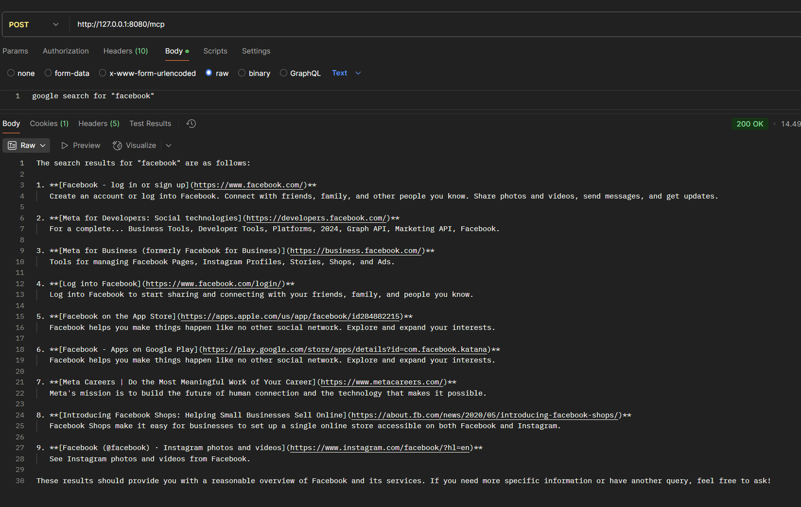

# Spring AI with Google Custom Search Integration

This project demonstrates how to build AI-powered applications using Java and Spring Boot, leveraging Spring AI's Model Context Protocol (MCP) and Google Custom Search API. It showcases the integration of large language models (LLMs) with external tools and resources in a structured and extensible way.

## Features

- **Spring AI MCP**: Provides a standardized protocol for AI models to interact with external tools and resources.
- **Google Custom Search API**: Enables custom web search capabilities.
- **Spring Boot**: Facilitates rapid development with a modular and extensible design.

## Prerequisites

- Java 17 or higher
- Maven 3.8+ or Gradle
- API keys for:
  - LLM provider (e.g., OpenAI)
  - Google Custom Search API

## Getting Started

Follow these steps to set up and run the project:

### 1. Clone the Repository

```bash
git clone https://github.com/your-username/spring-ai-example.git
cd spring-ai-example
```

### 2. Configure the Application

Update the `application.yml` file in the `src/main/resources` directory with your API keys and other necessary configurations:

```yaml
spring:
  application:
    name: custom-search-tools-server
  ai:
    mcp:
      server:
        name: custom-search-tools-server
        version: 0.0.1
        type: SYNC

google:
  api:
    key: <YOUR_GOOGLE_API_KEY>
  custom:
    search:
      engine:
        id: <YOUR_GOOGLE_ENGINE_ID>
```

### 3. Build and Run the Application

Use Maven or Gradle to build and run the application:

#### Using Maven:
```bash
mvn clean install
mvn spring-boot:run
```

#### Using Gradle:
```bash
./gradlew build
./gradlew bootRun
```

### 4. Access the Application

Once the application is running, you can access it at `http://localhost:8090`.

## Usage

- **API Endpoints**: The application exposes RESTful APIs for interacting with the LLM and Google Custom Search. Refer to the API documentation for details.
- **Custom Prompts**: Modify the prompt templates in the `src/main/resources/prompts` directory to customize the behavior of the AI.

### Usage Example for McpServerController

To use the `McpServerController`, send a POST request to the `/mcp` endpoint with a JSON body containing the user input. Below is an example:



Replace the input string with your query to get a response from the AI-powered chat system.

## Controllers

### McpServerController

The `McpServerController` is a REST controller that handles incoming commands from users. It uses the `ChatClient` to process user inputs and generate responses based on a predefined prompt template. The controller is designed to:

- Accept user input via a POST request to the `/mcp` endpoint.
- Use a `PromptTemplate` to structure the input into a query.
- Interact with the `ChatClient` to generate a response.

This controller demonstrates how to integrate AI-powered chat capabilities with external tools like Google Custom Search API.

## Documentation References

- [Spring AI MCP Overview](https://docs.spring.io/spring-ai/reference/api/mcp/mcp-overview.html)
- [Google Cloud Console](https://console.cloud.google.com/apis)
- [Google Custom Search Engine](https://cse.google.com/)

## Contributing

Contributions are welcome! Please fork the repository and submit a pull request with your changes.

## License

This project is licensed under the MIT License. See the [LICENSE](LICENSE) file for details.

## Acknowledgments

- [Spring AI](https://docs.spring.io/spring-ai/reference/index.html)
- [Google Custom Search](https://cse.google.com/)
- [OpenAI](https://openai.com)

